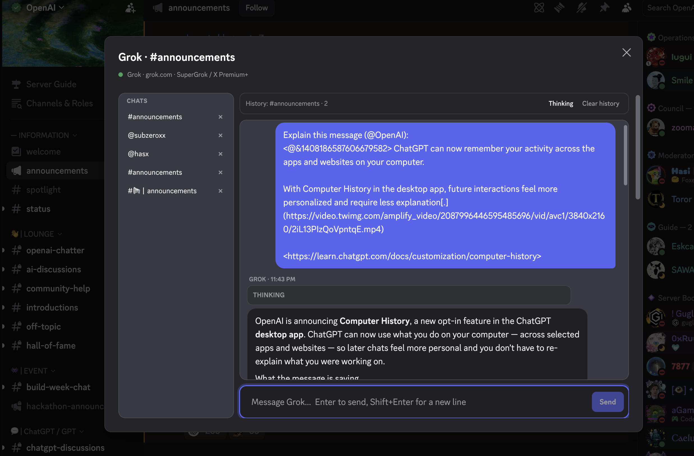
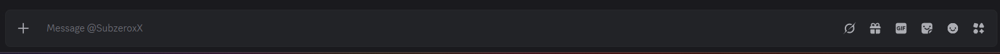
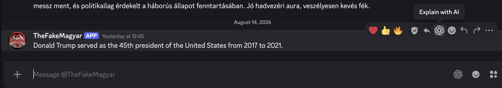
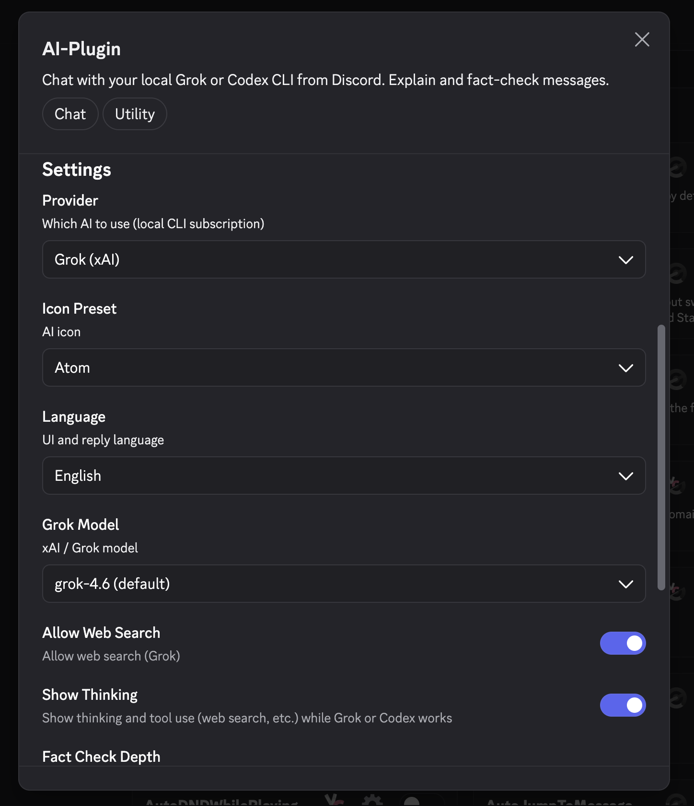

# AI-Plugin

Local **Grok (xAI)** or **Codex (OpenAI / ChatGPT)** inside Discord. The plugin talks to the CLI already signed in on your machine. No API key, no tokens in Discord’s renderer.

Works on **Discord Desktop** and **Vesktop**. It does **not** run in Vencord Web.



---

## Features

| Area | What you get |
| --- | --- |
| Chat bar | AI button next to GIF / sticker / Nitro |
| Channel header | AI button next to search / pins (works when you cannot type) |
| Messages | Hover actions and right-click: **Explain with AI**, **Fact-check with AI** |
| Commands | `/ai` (optional question), `/aiupdate` |
| History | Conversation saved per Discord channel / DM, listed in the chat sidebar |
| Context | Optional transcript so the AI can summarize, explain, or fact-check with nearby messages |
| Thinking | Optional live view of reasoning and tool use (Grok and Codex) |
| Providers | Grok CLI or Codex CLI, switched in settings |
| Models | Grok 4.6 / 4.5, or GPT-5.6 Sol–Luna / 5.5 / 5.4 / 5.4-Mini |
| Language | English (default), Magyar, Deutsch, Español |
| Icon | Default, Grok, OpenAI, Atom, or a custom SVG (`currentColor`) |
| Updates | venpm, `/aiupdate`, settings **Update now**, or auto-pull on Discord start |

---

## Screenshots

### Chat bar

AI button next to GIF / sticker / Nitro.



### Chat window

Per-channel history. Grok or Codex through the local CLI.


### Explain / Fact-check with AI

Message hover and context menu. Fact-check turns on Grok web search and lets the CLI run multiple tool turns so you get a full verdict, not just “I’ll look that up.”



### Settings

Provider, model, language, icon, paths, updates.



---

## Requirements

| What | Why |
| --- | --- |
| Equicord or Vencord **source tree** | Userplugins only load after a source build. The installer `.asar` cannot load this plugin. |
| Discord Desktop or Vesktop | The CLI runs in Electron’s main process. |
| [Grok CLI](https://x.ai/cli) and `grok login` | SuperGrok / X Premium+. Needed if the provider is Grok. |
| Codex CLI and `codex login` | ChatGPT / Codex desktop app, or `npm i -g @openai/codex`. Needed if the provider is Codex. |

### Grok

PowerShell:

```powershell
irm https://x.ai/cli/install.ps1 | iex
grok login
grok models
```

A line like `You are logged in with grok.com.` means the plugin can attach.

### Codex

Install the ChatGPT / Codex desktop app, or:

```bat
npm.cmd i -g @openai/codex
codex login
```

Codex uses `%USERPROFILE%\.codex\auth.json`. Access tokens stay on disk and are never sent to Discord’s renderer. Same for Grok (`%USERPROFILE%\.grok\auth.json`).

---

## Install

Windows examples use **cmd.exe**.

Do **not** paste `$env:USERPROFILE` into cmd. That is PowerShell. venpm would save the `$env:…` text as the folder path and `git clone` would fail with `could not create leading directories`.

### venpm (recommended)

[venpm](https://venpm.dev) clones the plugin into `src\userplugins\AI-Plugin` and rebuilds the client. Index format: [Your First Plugin](https://venpm.dev/author/your-first-plugin.html).

Close Discord completely (tray icon too). Then:

```bat
npm.cmd install -g @kamaras/venpm
venpm doctor
venpm config set vencord.path %USERPROFILE%\Equicord
venpm repo add https://github.com/TheRealMagyar/Vencord-ai-plugin/releases/latest/download/plugins.json --name ai-plugin
venpm install AI-Plugin
```

If the source tree is under Documents:

```bat
venpm config set vencord.path %USERPROFILE%\Documents\GitHub\Equicord
```

Vencord instead of Equicord: point `vencord.path` at that folder.

PowerShell (only if you are actually in PowerShell):

```powershell
venpm config set vencord.path "$env:USERPROFILE\Equicord"
```

Then start Discord → **Settings → Plugins → AI-Plugin → Enable**.

Also enable the plugin APIs this plugin depends on, if they are listed separately:

- Chat Input Button API
- Message Popover API
- Commands API
- Header Bar API

### Manual (no venpm)

Close Discord. In cmd:

```bat
cd /d "%USERPROFILE%\Equicord"
if not exist src\userplugins mkdir src\userplugins
if not exist src\userplugins\AI-Plugin git clone https://github.com/TheRealMagyar/Vencord-ai-plugin.git src\userplugins\AI-Plugin
corepack pnpm@11.20.0 install
corepack pnpm@11.20.0 run build
```

If `bun` already works on that tree:

```bat
bun install
bun run build
```

If bun cannot link `@vencord/discord-types`, use `corepack pnpm@11.20.0` instead. You do not need a global pnpm install.

Do not use `mkdir … -Force` in cmd. `-Force` is a PowerShell flag and creates a folder named `-Force`.

### Inject Discord (first time)

If Equicord / Vencord is not patched into Discord yet:

```bat
cd /d "%USERPROFILE%\Equicord"
set EQUICORD_USER_DATA_DIR=%CD%
set EQUICORD_DIRECTORY=%CD%\dist\desktop
set EQUICORD_DEV_INSTALL=1
dist\Installer\EquilotlCli.exe -install -branch stable
```

If `resources\app.asar` is a **directory**, set `index.js` inside it to:

```js
require("C:\\Users\\User\\Equicord\\dist\\desktop\\patcher.js");
```

Use the real path of **your** Equicord / Vencord `dist\desktop\patcher.js`.

---

## Update

### venpm

```bat
venpm update AI-Plugin
```

### Plugin UI

- Settings → AI-Plugin → **Update now**
- Slash command: `/aiupdate`
- Optional: **Auto update** on Discord startup

Restart Discord after a successful update.

### Manual git

```bat
cd /d "%USERPROFILE%\Equicord"
git -C src\userplugins\AI-Plugin fetch origin
git -C src\userplugins\AI-Plugin reset --hard origin/main
corepack pnpm@11.20.0 run build
```

`git reset --hard` makes GitHub win over local edits in the plugin folder.

Older clones may still live in `src\userplugins\grokAi`. The updater looks for both `AI-Plugin` and `grokAi`. Keep only one folder so the plugin is not loaded twice.

---

## Usage

| Action | How |
| --- | --- |
| Open the AI chat | Chat bar AI button, channel header AI button, right-click the channel → **Open AI**, or `/ai` with no text |
| Ask in the current channel | `/ai` + your question (reply is posted as a bot message) |
| Explain a message | Hover the message → AI icon, or right-click → **Explain with AI** |
| Fact-check a message | Hover the message → shield icon, or right-click → **Fact-check with AI** |
| Update the plugin | `/aiupdate` |

The plugin connects to the Grok / Codex CLI in the background when Discord starts, so opening the AI window does not wait on a fresh handshake.

The chat window keeps history **per Discord channel or DM**. Clearing history in the modal only clears that thread. Closing the window does not stop a running reply — reopen it to see thinking and tool progress. **Stop** interrupts the current run. The left sidebar lists channels / DMs that already have AI history.

Turn on **Show thinking** (settings or the toolbar toggle) to watch Grok / Codex reason and use tools such as web search while they work. The final answer stays separate from that trace.

If **Include channel context** is on, the AI can use recent messages for summaries, explain, and fact-check (the target message is marked with `>>>`).

Enter sends. Shift+Enter inserts a new line.

---

## Settings

| Setting | Description |
| --- | --- |
| Provider | Grok (xAI) or Codex (OpenAI / ChatGPT) |
| AI icon | Default, Grok, OpenAI, Atom, or Custom SVG |
| Custom SVG | Shown only when the icon is Custom SVG |
| Language | English, Magyar, Deutsch, Español (UI and reply language) |
| Grok model | `grok-4.6` (default) or `grok-4.5`. Hidden when Codex is selected |
| Codex model | CLI default, GPT-5.6 Sol / Terra / Luna, GPT-5.5, 5.4, 5.4-Mini. Hidden when Grok is selected |
| Allow web search | Grok only |
| Show thinking | Live thinking + tool use (web search, etc.) for Grok and Codex |
| Fact-check depth | Quick (1 search), Balanced (2 searches, default), or Deep (search + read sources) |
| Include channel context | Attach Discord history for summaries, explain, and fact-check |
| Grok / Codex path | Optional override if auto-detect fails |
| Auto update | Pull from GitHub when Discord starts |

### Icon

Built-in marks: **Default**, **Grok**, **OpenAI**, **Atom**. They use `currentColor`, so they follow Discord light / dark theme.

**Custom SVG** accepts a full document or a single shape:

```svg
<svg viewBox="0 0 24 24">
  <path d="M12 2 15 9 22 12 15 15 12 22 9 15 2 12 9 9Z"/>
</svg>
```

```svg
<path d="M12 2 15 9 22 12 15 15 12 22 9 15 2 12 9 9Z"/>
```

Scripts, event handlers, and external images are stripped.

---

## venpm index

Authors / other users can add this repo with:

```bat
venpm repo add https://github.com/TheRealMagyar/Vencord-ai-plugin/releases/latest/download/plugins.json --name ai-plugin
venpm install AI-Plugin
```

`plugins.json` lives at the repo root and is published as a GitHub Release asset (`latest`) on every push to `main`. See [venpm.dev](https://venpm.dev).

---

## How it connects

`native.ts` runs in Electron’s main process:

1. Resolves the CLI from the setting, the default install path, then `PATH`.
2. Reads local login metadata from `auth.json`. Access tokens are never sent to the renderer.
3. Runs a headless turn in an isolated temp directory (`grok --prompt-file` or `codex exec --json`), with file / shell tools disabled.

Sessions are resumed per channel and per provider (`--resume` / `codex exec resume`).

---

## Troubleshooting

| Symptom | What to try |
| --- | --- |
| `could not create leading directories of '$env:USERPROFILE\…'` | You ran a PowerShell path in **cmd**. Fix: `venpm config set vencord.path %USERPROFILE%\Equicord` |
| CLI not installed | Install Grok or Codex, then restart Discord |
| No active subscription | `grok login` or `codex login` |
| No chat-bar button | Enable **AI-Plugin**; turn on Chat Input Button API; rebuild; restart Discord |
| `/ai` missing | Enable Commands API; restart after build |
| Inject / `app.asar` errors | Close Discord completely (tray included) and inject again |
| bun cannot link `@vencord/discord-types` | `corepack pnpm@11.20.0 install` |
| Plugin listed twice | Both `src\userplugins\grokAi` and `src\userplugins\AI-Plugin` exist. Keep one |
| Update cannot find the folder | Plugin must be a git clone named `AI-Plugin` or `grokAi` under `src\userplugins` |

Desktop and Vesktop only.

---

## License

GPL-3.0-or-later, as required for Vencord / Equicord plugins.
